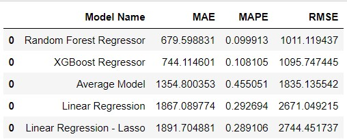
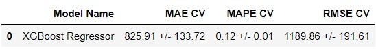
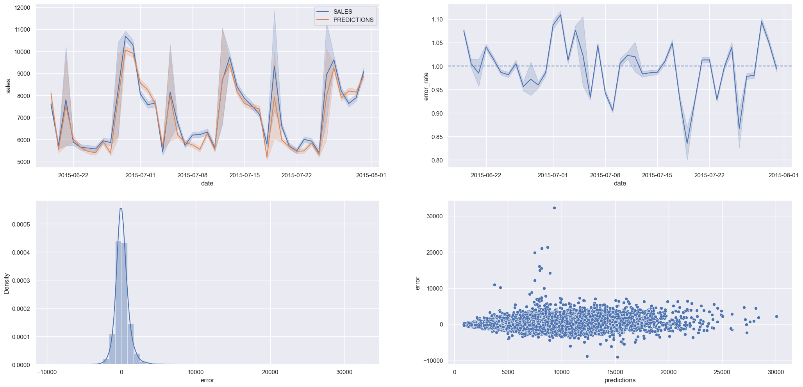

# Rossman Sales Model

O objetivo deste projeto é fornecer uma previsão de vendas baseado em modelos de Machine Learning, para auxiliar na melhor tomada de decisões e planejamento da empresa.

## 1. Os Dados

O conjunto de dados que representam o contexto está disponível na plataforma do Kaggle. O link para acesso aos dados :

https://www.kaggle.com/c/rossmann-store-sales

### 1.1 - Sobre os Dados

A maioria dos campos é auto-explicativo, segue uma descrição daqueles campos que não são:

Id - um Id que representa a (Loja, Data) duplo com os dados de teste

Store - um Id único de cada loja

Sales - o faturamento da loja naquele dia (campo que será previsto)

Customers - número de clientes daquele distance

Open - um indicador se a loja estava aberta: 0 = fechada, 1 = aberta

StateHoliday - indica um feriado estadual. Normalmente todas as lojas, com algumas excessões, estão fechadas em feriados estaduais. a = public holiday, b = Easter holiday, c = Christmas, 0 = None

SchoolHoliday - indica se a (Loja, Data) foi afetada pelo fechamento de escolas públicas

StoreType - diferencia entre quatro tipos de lojas: a, b, c, d

Assortment - descreve o nivel de sortimento da loja: a = basic, b = extra, c = extended

CompetitionDistance - distancia em metros para o competidor mais proximo

CompetitionOpenSince[Month/Year] - a data aproximada do mês e ano que o competidor mais proximo abriu

Promo - indica se a loja estava em promoção naquele distance

Promo2 - Promo2 é uma promoção contínua e consecutiva para algumas lojas : 0 = loja não participa, 1 = loja participa

Promo2Since[Year/Week] - descreve quando a loja começou a participar da Promo2

PromoInterval - descreve o intervalo consecutivo que a Promo2 se inicia

### 1.2 - Premissas Adotadas

As lojas que não possuiam a distancia de competidores tiveram uma distância de 200 kms considerada, uma distância bem maior que a distância máxima encontrada no dataset.

Datas que não apareciam no dataset foram preenchidas com as datas da loja.

## 2. Planejamento de Solução

A solução empregada no projeto foi o CRISP-DM, aplicando os passos a seguir:

Passo 1 - Descrição dos Dados: Analise dos dados e utilização de métodos estatisticos para chechagem de outliers.

Passo 2 - Feature Engineering: Criação de hipóteses e criação de variáveis baseadas nas variáveis originais.

Passo 3 - Filtragem de Variáveis: Faz a filtragem das linhas e deletar as colunas que não são relevantes para o modelo ou não fazem parte do escopo de negócio.

Passo 4 - Análise Exploratória de Dados: Validação das Hipóteses e exploração dos dados para entender melhor o impacto das variáveis no modelo.

Passo 5 - Preparação de Dados: Preparação dos dados para a aplicação nos modelos de Machine Learning.

Passo 6 - Feature Selection: Utilização do algoritmo Boruta para seleção das variáveis mais impactantes para o modelo.

Passo 7 - Modelagem de Machine Learning: Fazer o treinamento de Machine Learning e comparação dos resultados de diferentes algoritmos.

Passo 8 - Hyperparameter Fine Tunning: Utilização do método de Random Search para seleção dos melhores parametros para o modelo de Machine Learning.

Passo 9 - Tradução e Interpretação do Erro: Conversão da Performance do Modelo em resultados do negócio.

Passo 10 - Modelo em Produção: Publicação do Modelo na plataforma de cloud Heroku.

## 3. Modelos de Machine Learning Testados

- Average Model
- Linear Regression Model
- Linear Regression Regularized Model (Lasso)
- Random Forest Regressor
- XGBoost Regressor

### 3.1 - Performance dos modelos

## 4. Performance do Modelo Escolhido Após o  Hyperparameter Fine Tunning

Apesar do modelo de Random Forest Regressor apresentar uma performance ligeiramente melhor, optou-se por utilizar o XGBoost Regressor pelo menor uso do espaço dos servidores.

Foram gerados os gráficos com a comparação entre os valores preditos e os valores reais, uma análise da taxa de erro, a distribuição dos erros e a distribuição dos erros em relação as predições.

## 5. Conclusão

Foi executado um ciclo de CRISP-DM que trouxe um modelo de Machine Learning com uma performance satisfatória, considerando o MAPE (Mean Absolute Percentage Error) obtido. Os resultados obtidos podem ser melhorados num próximo ciclo com um método mais sofisticado de Hyperparameter Fine Tunning como o Grid Search.
